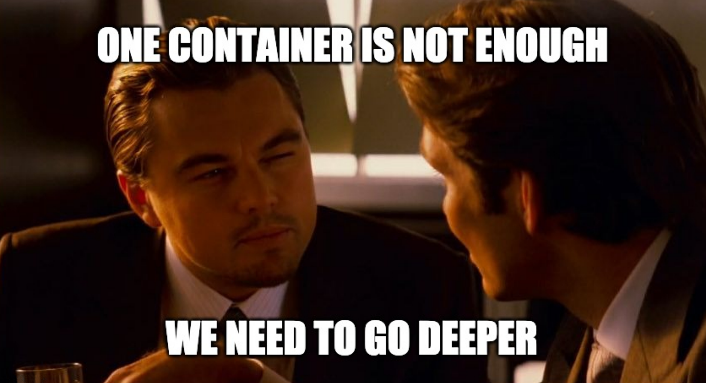
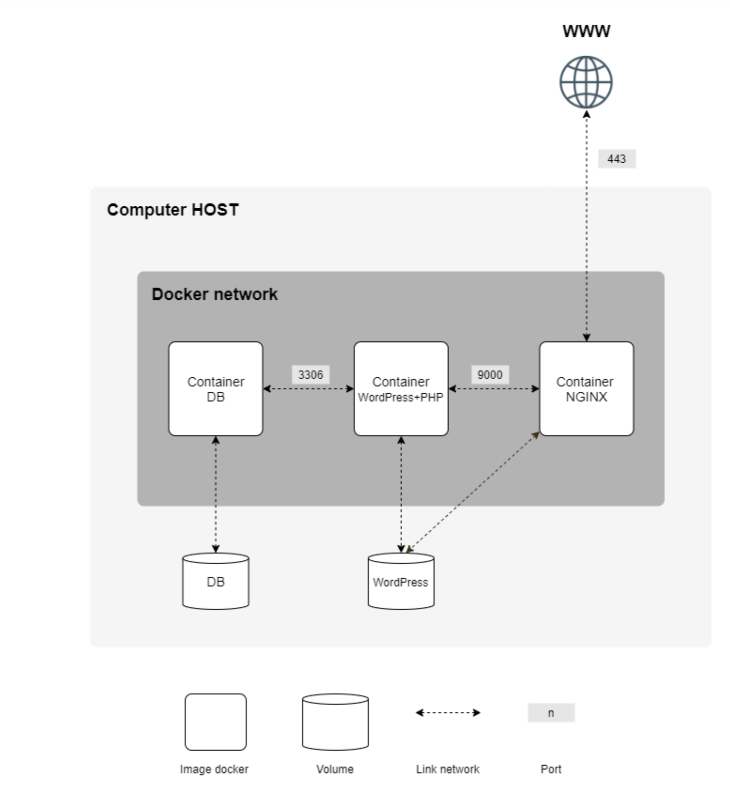

# Inception

Welcome to the 42 School Docker-Based System Administration Project! This project is designed to expand your knowledge and proficiency in system administration using Docker. 
Through this tutorial, you will learn how to virtualize multiple Docker images within your own personal virtual machine, gaining practical experience along the way.



## Project Overview
The aim of this project is to provide a comprehensive tutorial on virtualizing Docker images within your own personal virtual machine. 
You will learn the key concepts and techniques of containerization, empowering you to leverage its benefits in system administration.

## What is Containerization?
Containerization is a revolutionary technology that enables the isolation and encapsulation of software and its dependencies. 
It allows applications to run reliably and consistently across different computing environments, ensuring seamless deployment and portability.

## Why Containerization Matters
Containerization has become a fundamental technology in modern system administration.
It enables the encapsulation of software and its dependencies, ensuring consistent and reliable execution across different computing environments.
By utilizing containerization platforms like Docker, system administrators can streamline software deployment, improve scalability, and enhance resource utilization.

## Why Docker?
Docker is a leading containerization platform known for its ease of use and robust features. 
It provides a lightweight, flexible, and scalable solution for creating, distributing, and managing containers. 
Docker allows you to package your applications and their dependencies into portable units, known as Docker images, facilitating efficient development and deployment workflows.

# OVERVIEW

### Mandatory part

The project requires you to set up the following services:



1.  **NGINX** Container: This container should contain NGINX and support only ``TLSv1.2`` or ``TLSv1.3``. It will serve as the entrypoint to the infrastructure via port 443.

2.  **WordPress** + **php-fpm** Container: This container should include ``WordPress`` and ``php-fpm``. WordPress must be installed and configured properly, ``without NGINX``.

3. **MariaDB** Container: This container should contain ``MariaDB``, which will serve as the database for ``WordPress``.

4. **Volumes**: Two volumes need to be created:
    - Volume 1: This volume will store the WordPress database.
    - Volume 2: This volume will store the WordPress website files.

5. **Docker Network**: You need to establish a ``docker-network`` to allow communication between the containers.

### Bonus part

1. **Redis** Cache for WordPress: Set up a Redis cache container to properly manage the cache for your WordPress website. This will improve the performance and efficiency of your website.

2. **FTP** Server Container: Create an FTP server container that points to the volume containing your WordPress website files.
   This will allow you to easily manage and transfer files to and from the container.

3. Simple **Static Website**: Develop a simple static website in a language of your choice (excluding PHP). This can be a showcase site or a site for presenting your resume.
Host the static website in its own container.

4. **Adminer**: Set up an Adminer container. Adminer is a database management tool that allows you to conveniently manage your MariaDB container.

5. Additional Service of Your Choice: You have the freedom to choose and set up an additional service that you find useful for your project.
During the defense, please be prepared to explain your choice and explain its significance.

These services, along with their respective containers, volumes, and network, should be configured using ``Docker-Compose`` within a virtual machine environment.
Remember to follow the specific rules and guidelines mentioned in the project description.

## What You'll Learn
By working on this project, you will gain valuable skills and knowledge in the following areas:

1. **Infrastructure Setup**: You will learn how to design and set up a small infrastructure using Docker Compose.
   This includes configuring and connecting multiple containers and volumes to create a functional system.

2. **Containerization**: You will become proficient in creating Docker containers and writing Dockerfiles for different services.
   You will learn how to build and manage containers, define dependencies, and ensure container restart in case of failures.

3. **Docker Compose**: You will learn how to use Docker Compose to define and manage multi-container applications.
   This includes specifying container configurations, volumes, networks, and dependencies using a declarative YAML syntax.

4. **Networking and Communication**: You will gain experience in setting up and managing networks within Docker Compose.
   This involves establishing communication between containers, defining network rules, and configuring container access via specific ports.

5. **Service Configuration**: You will learn how to configure and customize services such as NGINX, WordPress, and MariaDB within Docker containers.
    This includes installing and setting up software, managing environment variables, and handling service-specific configurations.

6. **Best Practices**: Throughout the project, you will be encouraged to follow best practices for writing Dockerfiles and containerized applications.
    This includes using appropriate base images, optimizing container size, leveraging environment variables, and implementing secure communication protocols.

7. **Troubleshooting and Debugging**: As you work with containers and volumes, you may encounter challenges or issues that require troubleshooting.
    You will develop skills in diagnosing and resolving common containerization problems, understanding container logs, and ensuring container stability.

Overall, this project will provide you with hands-on experience in ``containerization``, ``infrastructure deployment``, and ``service configuration`` using Docker Compose.
These skills are highly relevant in modern software development and can be applied to various projects and scenarios.

## About this project

 Tools used for this project :
 
- ``Docker`` 
- ``NGINX`` 
- ``WordPress``
- ``Mariadb`` 
- ``Redis`` 
- ``FTP`` server
- ``Adminer``
- ``Portainer`` ( UI to manage your containerized applications)

Each of these tools will run on a docker container and will be interconnected via the docker network.

> ### Guide for the directories tree<br>
> Makefile: this file is the one we're gonna run to spin up all the containers. It uses the docker-compose command to launch all the required containers (in order)<br>
srcs<br>
|___.env: contains the environment variables file that will be available in certain containers.<br>
|___docker-compose.yml: it contains the configuration of every docker container that we will be launching, we specify the path that docker-compose will follow to build the image of the container, and then run an instance of it using docker-compose up<br>
|___requirements<br>
&nbsp;&nbsp;&nbsp;&nbsp;&nbsp;&nbsp;&nbsp;&nbsp;|___nginx<br>
&nbsp;&nbsp;&nbsp;&nbsp;&nbsp;&nbsp;&nbsp;&nbsp;|___wordpress<br>
&nbsp;&nbsp;&nbsp;&nbsp;&nbsp;&nbsp;&nbsp;&nbsp;|___mariadb<br>
&nbsp;&nbsp;&nbsp;&nbsp;&nbsp;&nbsp;&nbsp;&nbsp;|___bonus<br>
&nbsp;&nbsp;&nbsp;&nbsp;&nbsp;&nbsp;&nbsp;&nbsp;&nbsp;&nbsp;&nbsp;&nbsp;&nbsp;&nbsp;&nbsp;&nbsp;|___adminer<br>
&nbsp;&nbsp;&nbsp;&nbsp;&nbsp;&nbsp;&nbsp;&nbsp;&nbsp;&nbsp;&nbsp;&nbsp;&nbsp;&nbsp;&nbsp;&nbsp;|___ftp-server<br>
&nbsp;&nbsp;&nbsp;&nbsp;&nbsp;&nbsp;&nbsp;&nbsp;&nbsp;&nbsp;&nbsp;&nbsp;&nbsp;&nbsp;&nbsp;&nbsp;|___portainer<br>
&nbsp;&nbsp;&nbsp;&nbsp;&nbsp;&nbsp;&nbsp;&nbsp;&nbsp;&nbsp;&nbsp;&nbsp;&nbsp;&nbsp;&nbsp;&nbsp;|__portfolio<br>
&nbsp;&nbsp;&nbsp;&nbsp;&nbsp;&nbsp;&nbsp;&nbsp;&nbsp;&nbsp;&nbsp;&nbsp;&nbsp;&nbsp;&nbsp;&nbsp;|___redis<br>

## Getting Started

To Run this project, please use the following steps

Change the variable **WP_URL** in ``.env`` file and make sure to change the paths for the directories used to your own directories

### Install docker on your local machine, follow this guide https://docs.docker.com/engine/install/

### Install git on your local machine, it will depend on the OS running inside it, for example debian OS has the package manager Apt, to install git in Debian we use
```
sudo apt-get update && apt-get install git -y
```
### Clone the repository on your local machine
```
git clone https://github.com/oussamalakhdar/Inception/ && cd Inception
```

### Run the following command to build the docker images
```
make all
```
### To run the containers use
```
make up
```
### To stop the containers run
```
make down
```
### To clean all volumes run 
```
make clean
```
